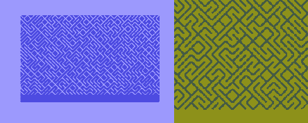

`10 PRINT` Game Boy
===================

`10 PRINT CHR$(205.5+RND(1)); : GOTO 10` is a concise and elegant single line of
code written in BASIC for the Commodore 64 sometime in the early 1980s. When
run, it produces a maze-like pattern on the screen in an endless loop.

This is my port of that one-liner for the original Game Boy. Written in
assembly language using the RGBDS toolchain.



> `10 PRINT` running on Commodore 64 (left) and Game Boy (right).

How comes is that?
------------------

[10 PRINT CHR$(205.5+RND(1)); : GOTO 10][10] is not only a witty one-liner but
also the title of a book. With the short program as the lowest common
denominator, the authors delve into diverse subjects like the Commodore 64,
maze in culture, and randomness in computing and art.

As I read the book and learned about `10 PRINT`, I thought that porting it to
the Game Boy would be a good learning experience and fun challenge. Not a
trivial one, though, as the Game Boy lacks some of the luxuries the Commodore 64
has through its KERNAL operating system and BASIC programming language.

I hope that you, fellow reader, will learn something as well or just have a
good time playing around with `10 PRINT`.

Watch it on a Game Boy
----------------------

Wanna watch the mesmerizing maze for real? Sure thing! Just download the
[preassembled ROM][rom], copy it over to a [flash cartridge][flash] and throw
it in your Game Boy. You can also load the ROM your favorite emulator or
[watch `10 PRINT` in your browser][browser].

Study and assemble the source
-----------------------------

Do you want to take a peek behind the curtains? I'm glad to hear that! There's
an [annotated version][asrc] of the source code that's easy to read on GitHub.
Give it a shot – if it's not your thing you can always read the
[plain assembly version][src].

### New to assembly language and low-level programming?

Then you may want to catch up on the basics, before reading the source. A
favorite book of mine and its associated web course has you covered:
[The Elements of Computing Systems][book] and [NAND2Tetris][n2t]. Another great
resource is [Easy 6502][e65] - an e-book that shows how to get started with
6502 assembly language.

### Assemble using RGBDS...

To assemble the `10 PRINT` Game Boy ROM, you'll need the assembler, linker and
fixer tools provided by the Rednex Game Boy Development System or RGBDS for
short. Go ahead and [install RGBDS][rgbds] on your system and come back here
when you're ready.

#### ...with `make`

If you are on a \*nixy system, like macOS or Ubuntu, and have Make installed,
you should be able to run `make 10-print.gb` in the root of this directory and
see *10-print.gb* appear before your eyes.

#### ...by hand

If Make is not your cup of tea, you can always do things the manual way. There
are three steps to assemble a ROM from source: assembling, linking and fixing.

You should be able to build *10-print.gb* by the following steps:

```sh
rgbasm -E -v -o "10-print.o" "10-print.asm"
rgblink -d -t -n "10-print.sym" -m "10-print.map" -o "10-print.gb" "10-print.o"
rgbfix -j -p 0x0 -t "10 PRINT" -v "10-print.gb"
```

[rgbds]: https://github.com/rednex/rgbds#1-installing-rgbds
[asrc]: ./10-pretty.md
[src]: ./10-print.asm
[rom]: https://github.com/svendahlstrand/10-print-game-boy/releases/download/v0x01/10-print.gb
[10]: http://10print.org
[asm]: #assembling-with-rgbds
[browser]: https://svendahlstrand.github.io/10-print-game-boy/
[make]: ./Makefile
[flash]: https://www.reddit.com/r/flashcarts/comments/6u7fuu/which_flashcart_do_i_want_start_here/
[n2t]: http://nand2tetris.org
[book]: http://nand2tetris.org/book.php
[e65]: https://skilldrick.github.io/easy6502/
